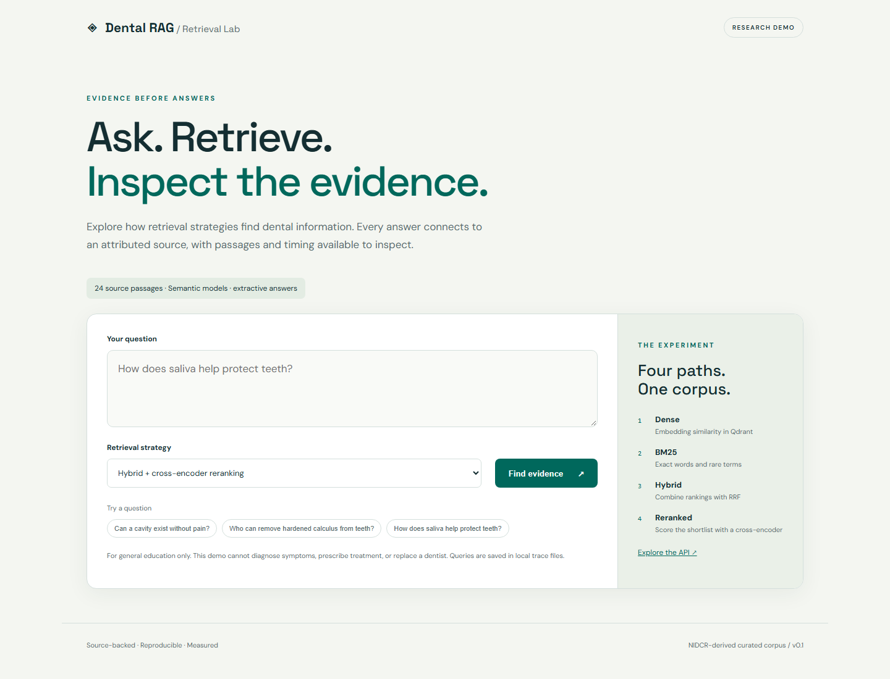

# Dental RAG Evaluation

A working retrieval lab that compares dense search, BM25, hybrid search, and hybrid search
with a cross-encoder reranker on source-backed dental questions. It includes a browser
demo, FastAPI API, experiment CLI, per-question traces, and a versioned evaluation dataset.

**Status:** local semantic retrieval and extractive generation verified. Optional OpenAI,
DeepEval, and Langfuse integrations are implemented but require your credentials and have
not been validated against live services. This is an educational portfolio project, not
a clinical tool.



## What you can inspect

- Real BGE-small-en-v1.5 embeddings through FastEmbed/ONNX and Qdrant local cosine search.
- BM25 + dense retrieval combined through reciprocal rank fusion.
- ms-marco-MiniLM-L-6-v2 cross-encoder reranking of a 12-passage shortlist.
- Cited extractive answers by default; optional evidence-constrained OpenAI generation.
- 24 attributed passages, 12 dev questions, and 30 test questions, including unsupported requests.
- Hit@1, recall@3, MRR@3, nDCG@3, latency, abstention, citation checks, and paired bootstrap intervals.
- Optional DeepEval faithfulness / answer relevancy and Langfuse tracing.
- CI, unit/API tests, Docker packaging, and local JSONL traces.

## Run on Windows

Python 3.11+ is required. Run commands from the repository root.

```powershell
git clone https://github.com/DarwishDS/dental-rag-evaluation.git
cd dental-rag-evaluation
python -m venv .venv
.\.venv\Scripts\python.exe -m pip install -e ".[dev]"
Copy-Item .env.example .env
.\.venv\Scripts\dental-rag.exe validate
.\.venv\Scripts\dental-rag.exe serve
```

Open [the local demo](http://127.0.0.1:8000) or [the API docs](http://127.0.0.1:8000/docs).
The first semantic run downloads public model weights; subsequent runs use `.cache/`.
There are no paid API calls in the default mode. The model downloads require internet access.
The server binds to localhost by default. Stop it with Ctrl+C.

On macOS/Linux, create the same virtual environment, activate it with `source .venv/bin/activate`,
and use `pip install -e '.[dev]'` and `dental-rag serve`.

## Ask and evaluate

```powershell
.\.venv\Scripts\dental-rag.exe ask "Who can remove hardened calculus from teeth?"
.\.venv\Scripts\dental-rag.exe evaluate --split dev --out artifacts/dev
.\.venv\Scripts\dental-rag.exe evaluate --split test --out artifacts/test
.\.venv\Scripts\python.exe -m pytest -q
.\.venv\Scripts\ruff.exe check src tests scripts
```

Reports include `report.json`, `report.md`, and `cases.jsonl`. Each record contains the
question, gold passage, retrieved passages, answer, citations, scores, latency, and trace ID.
The corpus/evaluation hashes, model names, settings, and dependency versions accompany every run.
Warmup and model loading are excluded from reported request latency.

`requirements-lock.txt` records the verified dependency versions (Windows-only packages
use platform markers). To reproduce them, install with `pip install -r requirements-lock.txt`
and then `pip install -e . --no-deps`. The ONNX artifact checksums are recorded in
`reports/semantic-test/model-artifacts.json`; model weights stay out of Git.

For a no-network infrastructure check after installing dependencies:

```powershell
.\.venv\Scripts\dental-rag.exe --backend smoke evaluate --split dev --out artifacts/smoke
.\.venv\Scripts\dental-rag.exe --backend smoke serve
```

Smoke mode uses deterministic lexical hashing and an overlap reranker. It is clearly
labelled and **must not be reported as semantic model performance**.

## Measured results

The checked-in [semantic test report](reports/semantic-test/report.md),
[machine-readable report](reports/semantic-test/report.json), and
[per-question records](reports/semantic-test/cases.jsonl) contain an actual local run.
See [the results discussion](docs/results.md) for exact scores and limitations.

The benchmark is intentionally small. The dev/test questions are disjoint, but they share
topics and corpus passages. Gold labels were authored alongside the summaries and have not
been independently reviewed. Do not generalize results to clinical correctness or claim
faithfulness scores from the default extractive generator.

## Optional LLM answers, judges, and hosted traces

```powershell
.\.venv\Scripts\python.exe -m pip install -e ".[cloud,eval]"
```

Edit your local `.env` to set `OPENAI_API_KEY`. Then run:

```powershell
.\.venv\Scripts\dental-rag.exe --generator openai ask "How does saliva protect teeth?"
.\.venv\Scripts\dental-rag.exe --generator openai evaluate --split test --judge --out artifacts/judged
```

Generation and DeepEval judging make paid API calls. Model IDs are configurable through
`DENTAL_OPENAI_MODEL` and `DENTAL_JUDGE_MODEL`. Check your provider's available models and
pricing before running. Set explicit input/output prices per million tokens to record
estimated generation cost; missing prices produce null cost rather than an invented estimate.
Judge costs are separate and are not included in that estimate.

To enable Langfuse, configure its keys and base URL and set `DENTAL_LANGFUSE_ENABLED=true`.
This sends query, answer, and retrieved context to your Langfuse instance. Local tracing is
always enabled. Avoid patient-identifying information. `.env`, caches, and local traces are
ignored by Git. The checked-in benchmark records contain only the authored public test questions.

## Docker

```sh
docker build -t dental-rag .
docker run --rm -p 127.0.0.1:8000:8000 -v dental-models:/app/.cache dental-rag
```

Docker packaging is provided; it has not been executed in the initial Windows validation.

## Repository guide

```text
src/dental_rag/      shared retrieval, generation, tracing, CLI, API, web UI
data/               versioned attributed corpus, source manifest, dev/test labels
scripts/            deterministic seed dataset builder
tests/              metric, pipeline, output validation, and API tests
reports/            measured semantic benchmark and per-case evidence
docs/               architecture, methodology, results, and next experiment
.github/workflows/  CI verification and smoke evaluation artifacts
```

Read [architecture](docs/architecture.md) and [methodology](docs/methodology.md) for design
choices, metric denominators, data provenance, abstention limitations, and evaluation caveats.
Rebuild the seed dataset with `python scripts/build_dataset.py`; the output is deterministic.
To add data, follow the schema in `data/corpus.jsonl` and add independently reviewed evaluation
labels. Never index the gold questions or answers.

## Resume wording

Use measured facts, with scope: “Built a dental RAG evaluation lab using Qdrant, BM25,
BGE embeddings, and cross-encoder reranking; compared four strategies on a versioned
source-backed benchmark with per-question tracing, retrieval metrics, and confidence intervals.”

Use [the results discussion](docs/results.md) before adding numerical improvements.
Do not claim the example “faithfulness 0.71 → 0.89”; those scores were never measured here.

Code is MIT licensed. Source summaries retain attribution to NIDCR; this project is not
affiliated with or endorsed by NIH. Source URLs and checking dates are in `data/sources.json`.
