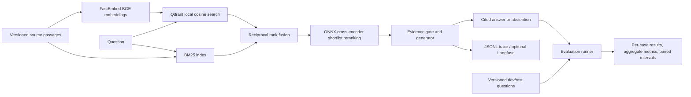

# Architecture

The CLI, FastAPI server, and experiment runner share one `Pipeline`. There is no second
implementation hidden in the web UI. The vector collection is rebuilt at startup;
model files are cached locally. Qdrant local mode removes the need for a separate database
for this tiny corpus. It is not a distributed serving configuration. The pipeline serializes
queries to protect inference resources and local trace writes.

The API returns passages and strategy-specific scores so a reviewer can inspect failures.
The browser renders text through `textContent` and only links to the corpus source host.
Cloud services are optional and must be configured explicitly. Secrets are read from
environment variables, never bundled into the frontend or recorded in the report.
